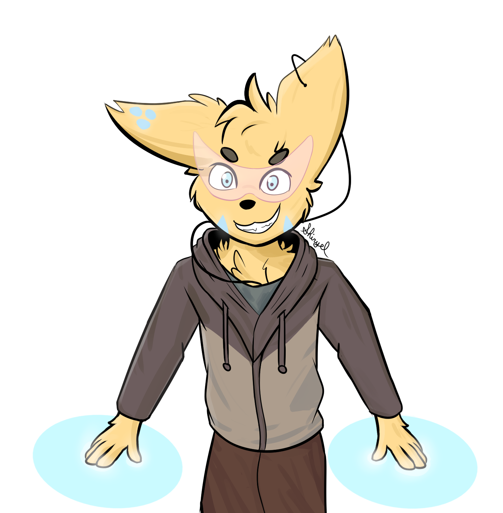

## :zzz: [𝙃𝙚𝙮 𝙮𝙤𝙪! 𝙮𝙤𝙪'𝙧𝙚 𝙛𝙞𝙣𝙖𝙡𝙡𝙮 𝙖𝙬𝙖𝙠𝙚!](https://youtu.be/_WZCvQ5J3pk)  

Welcome to my litle tech space :paw_prints: **warning**: bugs ahead, caution is adviced!

  
  

  

  
  
  

## :sparkles: 𝙁𝙚𝙖𝙩𝙪𝙧𝙚𝙙 𝙥𝙧𝙤𝙟𝙚𝙘𝙩 
`The project that I'm currently most working on`

## :unlock: 𝙁𝙊𝙎𝙎 𝙥𝙧𝙤𝙟𝙚𝙘𝙩𝙨
Name | Description | Status | [Zelda](https://youtu.be/oiuyhxp4w9I)
-----|-------------|--------|------
:robot: [Ryush](https://github.com/shiryel/ryush-bot) | Ryush is a discord bot specialized on automated tasks |  | 
:balloon: [SAoS](https://github.com/shiryel/saos) | A small component to make your CSS animations work on scroll with Svelte |  | [Link](https://shiryel.github.io/saos/)
:card_index: [Fatex](https://github.com/shiryel/fatex) | My graduation thesis, a visual Latex wrapper |  |
:pick: [MCX](https://github.com/shiryel/mcx) | A  project that aims to scale the vanilla minecraft servers |   |

### :video_game: 𝙂𝙖𝙢𝙚𝙨
Name | Description | [Zelda](https://youtu.be/JHY0PYZXvfU)
-----|-------------|--------
:sunglasses: [The Elevator](https://github.com/RoxoFoxo/the-elevator) | Seriously, an elevator | [Link](https://shiryel.itch.io/the-elevator)
:musical_note: [Dungeon Dance Dance](https://github.com/shiryel/dungeon-dance-dance) | A strange dungeon where you need to dance... weird | [Link](https://shiryel.itch.io/dungeon-dance-dance)

## :lock_with_ink_pen: 𝙋𝙚𝙧𝙨𝙤𝙣𝙖𝙡 𝙥𝙧𝙤𝙟𝙚𝙘𝙩𝙨
Name | Description | Status | [Zelda](https://youtu.be/Tt7bzxurJ1I)
-----|-------------|--------|------
:computer: [NixOS dotfiles](https://github.com/shiryel/nixos-dotfiles) |My current Linux configuration, NixOS, Sway and wayland |
:computer: [i3-gaps dotfiles](https://github.com/shiryel/i3gaps-dotfiles) | My old arch i3-gaps dotfiles |  |
:page_facing_up: [Neovim config](https://github.com/shiryel/neoVim-configs) | My vim configuration |  |
:notebook_with_decorative_cover: [My blog](https://github.com/shiryel/shiryel_blog) | A static blog made with svelte/sapper |  | [Link](https://www.blog.shiryel.com/)

### :star2: 𝙍𝙚𝙛𝙚𝙧𝙚𝙣𝙘𝙚𝙨
`For job interviews and self-reminder`

Name | Backend | Frontend
-----|---------|---------
:1st_place_medal: [Market](https://github.com/shiryel/challenge-market) |      |
:2nd_place_medal: [Cryptocoins](https://github.com/shiryel/challenge-cryptocoins) |     |
:3rd_place_medal: [Complains](https://github.com/shiryel/challenge-complains) |     |  

---

#### :feet: 𝙒𝙝𝙤 𝙖𝙢 𝙄 

Just a fennec that loves to learn new things, mess around with some ideas, draw and that likes [mu](https://youtu.be/cTLAZunyA38)[si](https://youtu.be/slze868xkPI)[cs](https://youtu.be/FF3Dr3_h0Hw) and [a](https://youtu.be/EYTLY17Io3c)[n](https://youtu.be/tuHe9lm5vUE)[i](https://youtu.be/ugH0YaBSaYk)[m](https://youtu.be/-PKNuZovuSw)[a](https://youtu.be/DRkgH7Uu-hA)[t](https://youtu.be/QZPSXI43P-I)[i](https://youtu.be/lIES3ii-IOg)[o](https://youtu.be/YgGzAKP_HuM)[n](https://youtu.be/hoYxHBlT-4I)[s](https://youtu.be/JJxflcxRkhI).

> [My art channel on telegram](https://t.me/shiryelden)

  

